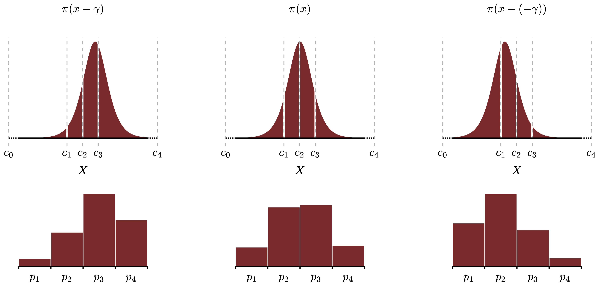

```{r, echo=FALSE}
knitr::opts_chunk$set(out.width = "90%", fig.align = 'center')
```

```{r, message=FALSE}
library(tidyverse)
theme_set(theme_classic())
library(cmdstanr)
options(mc.cores = 4)
library(tidybayes)
```

# Introduction

Michael Betancourt's online vignette [Ordinal Regression](https://betanalpha.github.io/assets/case_studies/ordinal_regression.html) is a wonderful exposition of Bayesian ordinal regression. To make sense of what's going on, he invokes a latent continuous random variable with distribution centered at 0 (the standard logistic distribution, for example) whose support gets cut into intervals by "cut points" to define ordinal probabilities. For a given individual, this continuous random variable's distribution gets shifted by an "affinity", and it is this affinity that we model as a linear function of predictors in ordinal regression. Betancourt shows visually how positively shifting the distribution of the latent variable with this affinity (while keeping cut points constant) changes the ordinal probabilities by making higher categories more likely and lower categories less likely. Conversely, a negative affinity makes lower categories more likely and higher categories less likely.


```{r, echo=FALSE, fig.cap = "From Betancourt: How the linear predictor $\\gamma$ changes the ordinal probabilities in ordinal regression."}

```


Later in the post, he gets to the Bayesian part of Bayesian ordinal regression, where he ends up recommending modeling the ordinal probabilities with a Dirichlet prior. Here, I found myself a bit confused with his implementation, which often gets referenced in Stan forums in discussions of ordinal regression. Instead of declaring the ordinal probabilities in the `parameters` block of the model, he declares the cut points in the `parameters` block and provides code to manually compute the Jacobian of the transformation between cut points and probabilities. If you were to instead declare the probabilities themselves in the parameter block, then you wouldn't have to manually compute this Jacobian. I wanted to convince myself that this is possible, although there may be some reason why Betancourt's implementation is to be preferred computationally.

Here is the implementation from the vignette for a model with no predictors:

```{r}
options(mc.cores=4)
model_induced <- cmdstan_model(
  "stan_programs/int_only_induced.stan", 
  stanc_options = list("O1")
  )
model_induced$print()
```

In comparison, here is my implementation:

```{r}
model_direct <- cmdstan_model(
  "stan_programs/int_only_direct.stan", 
  stanc_options = list("O1")
  )
model_direct$print()
```

In my implementation, the cut points must be calculated from the ordinal probabilities, but this is done straightforwardly: they are the logits of the cumulative probabilities.

# Testing equivalence

Now let's get a dataset to test this out. We'll look at the experimental philosophy data from Cushman et al. (2006), analyzed in Richard McElreath's textbook, where I encountered it, and shared in the companion R package, `rethinking`.[^1]

[^1]: Instructions for installing this package can be found at <https://github.com/rmcelreath/rethinking>.

```{r, message=FALSE}
library(rethinking)
data("Trolley")
df <- Trolley
```

The data consists of responses to various versions of the 'trolley problem'. The response is an assessment from 1 to 7 of the behavior of the character in the story by the respondent:

```{r}
simplehist( df$response , xlim=c(1,7) , xlab="response" )
```

Let's fit intercept-only models to this data using the two different versions of the Stan code printed above:
```{r, warning=FALSE, message=FALSE}
stan_data <- compose_data(
  y = df$response,
  K = 7,
  N = length(y)
)
if (file.exists("fit_objects/m_direct_int.Rds")) {
  m_direct <- readRDS("fit_objects/m_direct_int.Rds")
} else {
  m_direct <- model_direct$sample(
    data = stan_data,
    chains = 4,
    iter_warmup = 500,
    iter_sampling = 500
)
  m_direct$save_object(file = "fit_objects/m_direct_int.Rds")
}
if (file.exists("fit_objects/m_induced_int.Rds")) {
  m_induced <- readRDS("fit_objects/m_induced_int.Rds")
} else {
  m_induced <- model_induced$sample(
    data = stan_data,
    chains = 4,
    iter_warmup = 500,
    iter_sampling = 500
)
  m_induced$save_object(file = "fit_objects/m_induced_int.Rds")
}
```

Since these are intercept-only models with no predictors, the cut points are the only parameters (other than the generic affinity that applies to each individual, whose posterior should just be concentrated at 0 due to its prior). Here is the posterior of the cut points for each model:

```{r, fig.show="hold"}
plot_posterior_cutpoints <- function(posterior_cutpoints, title) {
  ggplot(posterior_cutpoints, aes(x = c, fill = response)) + 
  geom_histogram(bins = 50, position="identity") +
  scale_fill_brewer(palette = "OrRd") +
  scale_x_continuous(name = "Cut Points") +
  scale_y_continuous(expand = c(0,0)) +
  theme(
    axis.title.y = element_blank(),
    axis.line.y = element_blank(),
    axis.text.y = element_blank(),
    axis.ticks.y = element_blank(),
    legend.position = "none"
  ) +
  ggtitle(title)
}

posterior_cutpoints_from_m_direct <- m_direct %>%
  spread_draws(c[response]) %>%
  mutate(response = factor(response))

posterior_cutpoints_from_m_induced <- m_induced %>%
  spread_draws(c[response]) %>%
  mutate(response = factor(response))

plot_posterior_cutpoints(posterior_cutpoints_from_m_direct, title="Direct")
plot_posterior_cutpoints(posterior_cutpoints_from_m_induced, title="Induced")
```

These posteriors look pretty similar, evidence that the two models are equivalent.


One nice thing about my formulation is that the cumulative probabilities (which apply to every individual, since this model currently has no-predictors) are available without any further calculations:
```{r}
posterior_cum_probs_from_m_direct <- m_direct %>%
  spread_draws(q[response]) %>%
  mutate(response = factor(response))

ggplot(posterior_cum_probs_from_m_direct, aes(x = q, fill = response)) + 
  geom_histogram(bins = 50, position="identity") +
  scale_fill_brewer(name = "Rating", palette = "OrRd") +
  scale_x_continuous(name = "Cumulative Probabilities") +
  scale_y_continuous(expand = c(0,0)) +
  theme(
    axis.title.y = element_blank(),
    axis.line.y = element_blank(),
    axis.text.y = element_blank(),
    axis.ticks.y = element_blank(),
    #legend.position = "none",
  )
```


Now let's add covariates. Very briefly, in each version of the story presented, the protagonist does or does not take action (`action`), does or does not intend to harm as a means to their ends (`intention`), and does or does not make physical contact with whomever they're harming (`contact`).

```{r}
regression_direct <- cmdstan_model(
  "stan_programs/regression_direct.stan", 
  stanc_options = list("O1")
  )
regression_direct$print()
```
```{r}
stan_data <- compose_data(
  select(df, action, contact, intention),
  y = df$response,
  K = 7,
  N = length(y)
)
if (file.exists("fit_objects/m_direct_regress.Rds")) {
  m_direct_regress <- readRDS("fit_objects/m_direct_regress.Rds")
} else {
  m_direct_regress <- regression_direct$sample(
    data = stan_data,
    chains = 4,
    iter_warmup = 500,
    iter_sampling = 500
)
  m_direct_regress$save_object(file = "fit_objects/m_direct_regress.Rds")
}
```

```{r}
precis(m_direct_regress)
```


