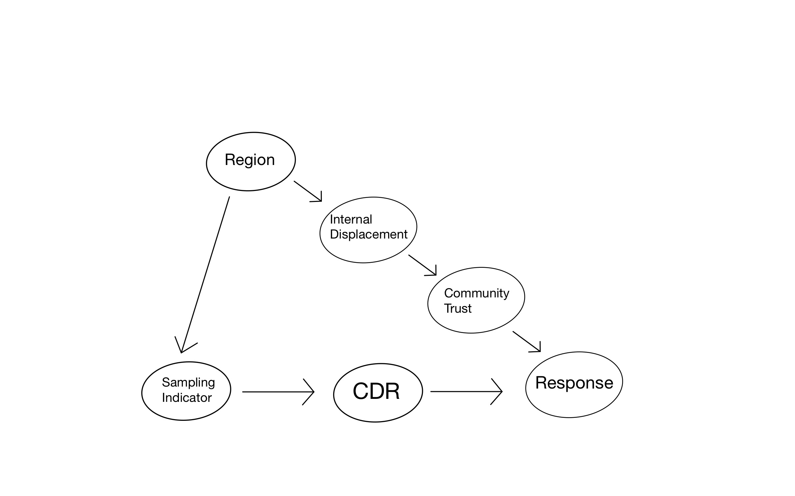

```{r, echo=FALSE}
knitr::opts_chunk$set(out.width="100%")
```

## Background

This is the third in a series of blog posts for a causal inference project on external validity. To summarize the previous posts if you are just joining us, we are interested in assessing the validity of results obtained from an experiment or RCT in a population distinct from the one in which the experiment was run. If we conclude that the results are not in fact valid in this new population, we would like to somehow adjust the experimental results to the new population. For more background, you can find the previous posts [here](../sampling-bias-and-causal-inference/index.qmd) and [here](../identification-for-external-validity/index.qmd).

In the last blog post, we discussed the matter of *identification*, the first order of business in any form of causal inference. It amounts to making some assumptions and showing how given those assumptions, an infinite amount of the observed data would reveal to us what we're interested in. Identification sets the stage for *estimation*. Estimation amounts to employing our finite data set to produce a best guess of the quantity we're interested in.

Since we're attempting to generalize experimental data to a new population, naturally the quantity we're interested in is the average effect of the experimental treatment in the new population. In the example we've been working with, this treatment has been a community reconstruction and reconciliation intervention in a country that has just experienced a civil war. We will simulate hypothetical data for our purposes, but there is a real example lurking in the background ([Fearon et al. (2009)](https://www.aeaweb.org/articles?id=10.1257/aer.99.2.287))

## Simulating Data

```{r}
#| label: fig-example
#| fig-cap: "Causal Graph for Field Experiment"
#| echo: false

```

Our data will be generated according to the causal graph shown in @fig-example. In particular, we will adopt the following simulation set-up, with numbers taken directly from the chapter "Generalizing Experimental Results" by Erin Hartman appearing in [*Advances in Experimental Political Science*](https://www.cambridge.org/core/books/advances-in-experimental-political-science/51EECAC7C72DC21B2DBFEDE2093E2EC3). Aside for the response, all our variables will be binary to make things simple.

There are 2000 different villages in our hypothetical country with exactly half in the northern region ($R=1$) and half in the southern region ($R=0$). We will consider a scenario in which the northern region experienced the civil war and resulting displacement more severely. Specifically, we will assume that 80% of villages in the north had high internal displacement ($I=1$), but only 20% of the villages in the south. Internal displacement affects the resulting amount of trust in the village, and so we will assume that whereas community trust is high ($T=1$) in 70% of the villages without displacement, it is high in only 10% of the villages that experienced high displacement.

Here is how we create the data in R:

```{r, message=FALSE}

library(tidyverse)

region = factor(rep(c("south","north"), each = 1000))

displace_south = factor(rep(c("low", "high"), times = c(800, 200)))
displace_north = factor(rep(c("low", "high"), times = c(200, 800)))
displace = c(displace_south, displace_north)

trust_south_low = factor(rep(c("low", "high"), times = c(240, 560)))
trust_south_high = factor(rep(c("low", "high"), times = c(180, 20)))
trust_north_low = factor(rep(c("low", "high"), times = c(60, 140)))
trust_north_high = factor(rep(c("low", "high"), times = c(720, 80)))
trust = c(trust_south_low, trust_south_high, trust_north_low, trust_north_high)

country = tibble(region, displace, trust)


```

Note that no randomness has been invoked in the generation of these variables: these variables can be viewed as simply given to us or fixed (in the language of statistics, "conditioned upon") for the purposes of our analysis.

Proceeding, we understand that researchers have carried out a randomized control trial on the villages in the country, but out of practicality, they have only sampled into their experiment villages in the northern region of the country. In particular, we will assume that the 100 villages that end up in their experiment is a simple random sample (SRS) of the 1000 total villages in the north so that every village in the north has an equal probability of ending up in the experiment.

```{r}
set.seed(0)
samp = country %>%
  slice_sample(n = 100, weight_by = rep(c(0,1), each = 1000)) %>% #Assign 0 weight of being included in the experimental sample to villages in the south
  mutate(treat = ifelse(row_number() %in% sample(100, 50), 1, 0)) #Assign treatment randomly to units in experiment 

```

To complete our simulation, we specify how community trust and the community intervention jointly shape the response $Y$, which we will take to be the amount of money contributed by village residents to community-reconstruction projects. We will suppose that the amount of community trust determines the impact of the intervention, so that in communities with high trust, the intervention has an average effect of 75\$, whereas in low trust communities, the intervention on average does not make a difference.

```{r}
samp = samp %>% 
  rowwise() %>%
  mutate( y = case_when(
    trust == "low" & treat == 0 ~ rnorm(1, 10, 3),
    trust == "low" & treat == 1 ~ rnorm(1, 10, 3),
    trust == "high" & treat == 0 ~ rnorm(1, 50, 10),
    trust == "high" & treat == 1 ~ rnorm(1, 125, 20) 
  ))

#Realistically assume that there's more variability among the larger responses.

samp

```

So in our data generating process, randomness enters in exactly three places: first, in the collection of the simple random sample of the northern villages, second, in the randomized treatment assignment, and third, in the generation of the response given trust and treatment in the experiment. It is because of this randomness that we cannot precisely recover the true population average treatment effect, but only approximate it. Naturally, we will want to understand what kind of impact the randomness has on the quality of our estimation. This is the statistical part of causal inference. Note that in the case of a simulation, we know exactly what kind of randomness we're dealing with since we generated it. In the real world, we would not know how exactly the data was generated, and so we would use the data itself to estimate the uncertainty in our estimators, which is simultaneously quite meta *as well as* a fundamental and ubiquitous technique that statisticians take for granted.

### The estimand

The most natural estimand in this example is the country-wide average treatment effect. In other words, the target population in the example is the entire country. I note that we are diverging slightly from our set-up in the [first blog post](../sampling-bias-and-causal-inference/index.qmd), where I wrote that the target population and the experiment sample would be viewed as two separate data sets $\Omega_t$ and $\Omega_s$ and defined the PATE as $E_{\Omega_t}[Y(1)-Y(0)] = E_{\Omega_t\cup\Omega_s}[Y(1)-Y(0) \mid S = 0]$. In our current example, the target population includes the villages in the experiment so that $\Omega_s \subset \Omega_t$. We then have

$$PATE = E_{\Omega_t}[Y(1)-Y(0)] = E_{Ωt\cupΩs}[Y(1)−Y(0)]$$ without the conditioning event $S=0$.

This essentially comes down to the difference between "transporting" the causal effect versus "generalizing" it, but these are fundamentally the same problem with the same solution. In both cases, we are required to adjust the sample average treatment effect to the distribution of effect modifiers in a target population--in the case of generalization, this target population includes the experimental sample, whereas in transportation, it does not.

Since we generated the data, we can calculate the *PATE*:

First note the proportion of villages in the country with high and low community trust:

```{r}
group_by(country, trust) %>% 
  summarise(prop = n()/nrow(.))
```

Now:

\begin{align*}

PATE &= E[Y(1)-Y(0)] \\
&= P(T=0)E[Y(1)-Y(0) \mid T=0] + P(T=1)E[Y(1)-Y(0) \mid T=1] \\
&= 0.6\times\$0 + 0.4\times\$75 \\
&= \$30

\end{align*}

## Estimators

The identification result from the last blog post modified to the situation of generalization rather than transportation is the following

$$PATE = E_{\Omega_t}\{E(Y \mid D=1, S=1, W) - E(Y \mid D=0, S=1, W)\},$$

where $W$ is a valid adjustment set satisfying the assumptions laid out in the last blog post.

With this identification result, if $W$ is discrete, then we can implement a post-stratification estimator as its sample analog

$$ 
\widehat{PATE_{ps}} = \sum_w\widehat{SATE_w}P_{\Omega_t}(W=w),
$$

Here, $\widehat{SATE_w}$ is the difference in means between the treatment groups in the experiment within the stratum $W=w$.

We'll implement this estimation for the two valid adjustment sets $W$ in our data-set: $W$ = `displace` and $W$ = `trust`. $W$ = `displace` is the more realistic adjustment set, as it is unlikely the researchers would have any direct measurement of community trust in their experimental villages, let alone villages across the country. Unfortunately, $W$ = `displace` gives rise to a less precise estimator than $W$ = `trust`, as we will see shortly.

First, using $W$ = `displace`:

```{r}
options(dplyr.summarise.inform = FALSE)
samp_disp = samp %>% 
  group_by(displace, treat) %>%
  summarise(mn = mean(y))

samp_disp

wt_high = mean(country$displace == "high")
wt_low = mean(country$displace == "low")
pate_hat_ps_disp = wt_high*(samp_disp$mn[2]-samp_disp$mn[1]) + wt_low*(samp_disp$mn[4]-samp_disp$mn[3])

pate_hat_ps_disp
```

Now, using using $W$ = `trust`:

```{r}

samp_trust = samp %>% 
  group_by(trust, treat) %>%
  summarise(mn = mean(y))

samp_trust

wt_high = mean(country$trust == "high")
wt_low = mean(country$trust == "low")
pate_hat_ps_trust = wt_high*(samp_trust$mn[2]-samp_trust$mn[1]) + wt_low*(samp_trust$mn[4]-samp_trust$mn[3])

pate_hat_ps_trust

```

Finally, let's look at the unadjusted sample average treatment effect (SATE).

```{r}
(SATE = mean(samp$y[samp$treat==1]) - mean(samp$y[samp$treat==0]))
```

Now, let's simulate many realizations of our data-set, calculating the $SATE$ and our two estimates of the $PATE$, for each one. The question arises of which randomness we should include in the simulation. Recall, there are three sources of randomness: the drawing of the simple random sample for the experiment, the randomized treatment assignment, and finally the generation of the response among these sampled units. We choose to include all of this randomness in the data generating process in our simulation. The function `single_data` handles this and simulates a single data-set accordingly[^1]:

[^1]: This code is slow, taking a couple of minutes to run.

```{r}

single_data = function() {
  country %>%
    slice_sample(n = 100, weight_by = rep(c(0,1), each = 1000)) %>%
    mutate(treat = ifelse(row_number() %in% sample(100, 50), 1, 0)) %>%
    rowwise() %>%
    mutate( y = case_when(
      trust == "low" & treat == 0 ~ rnorm(1, 10, 3),
      trust == "low" & treat == 1 ~ rnorm(1, 10, 3),
      trust == "high" & treat == 0 ~ rnorm(1, 50, 10),
      trust == "high" & treat == 1 ~ rnorm(1, 125, 20) 
    ))
}

estim = function(samp, w) {
  samp_w = samp %>% 
  group_by({{w}}, treat) %>%
  summarise(mn = mean(y))
  
  wt_high = mean(pull(country, {{w}}) == "high")
  wt_low = mean(pull(country, {{w}}) == "low")
  pate_hat_ps_trust = wt_high*(samp_w$mn[2]-samp_w$mn[1]) + wt_low*(samp_w$mn[4]-samp_w$mn[3])
  
}


single_simul = function(data_gen_fun) {
  samp = data_gen_fun() 
  est_trust = estim(samp, trust)
  est_disp = estim(samp, displace)
  est_samp = mean(samp$y[samp$treat==1]) - mean(samp$y[samp$treat==0])
  return(c("est_trust"=est_trust, "est_disp"=est_disp, "SATE"=est_samp))
}
  
```

```{r, cache=TRUE}
r = 2000
ests = map_dfr(1:r, ~ single_simul(single_data))
```

The distribution of the various estimates across simulations is summarized in @tbl-table.

```{r}
#| label: tbl-table
#| tbl-cap: "Performance of estimators in simulation"
#| echo: false
library(gt)
est_summary = ests %>%
  pivot_longer(cols = everything(), names_to = "Estimator") %>%
  group_by(Estimator) %>%
  summarise(Mean = mean(value), sd = sd(value)) %>%
  mutate(Bias = Mean - 30) 
  
est_summary %>%
  select(Estimator, Bias, sd) %>%
  gt() %>%
  fmt_number(columns = c("Bias", "sd")) %>%
  cols_label(sd = "Standard Error") 
  
```

Clearly, the sample average treatment effect (SATE) is a vast underestimate of the PATE. We see that adjusting for displacement or trust will eliminate this bias, but adjusting for the latter produces a much more precise estimate.

## Further notes about the Standard Errors

As I mentioned earlier, statistics gives us tools to estimate the uncertainty in our estimators from a single data-set. And thank goodness for this, because in the real world, we only have a single data-set[^2]. In terms of our post-stratification estimator, we can estimate its standard error with the formula

[^2]: Ignoring the notion of bootstrapping for the moment

$$
\widehat{SE}(\widehat{PATE_{ps}}) = \sqrt{\sum_w{P_{\Omega_t}(W = w)^2\widehat{Var}(\widehat{SATE_{w}})}}.
$$

This formula pushes the question of estimating the standard error of $SATE_w$. It turns out that the statistician Jerzy Neyman at the beginning of the 20th century proposed an estimator for just such a quantity[^3]: the standard Neyman variance estimator within strata $W=w$ is given by: $$\widehat{Var}(\widehat{SATE_{w}}) = \frac{S_{T}(w)^2}{N_{T}(w)} + \frac{S_{C}(w)^2}{N_{C}(w)}$$

[^3]: <https://www2.stat.duke.edu/courses/Spring14/sta320.01/Class7.pdf>

From just the first sample we generated, we calculate standard error for both our estimates of the $PATE$ with the following code:

```{r}
#Neyman standard error for estimator adjusting by displacement
samp_low_trt = filter(samp, displace == "low", treat == 1) %>%
  pull(y)
samp_low_con = filter(samp, displace == "low", treat == 0) %>%
  pull(y)
var_low = var(samp_low_trt)/length(samp_low_trt) + var(samp_low_con)/length(samp_low_con)

samp_high_trt = filter(samp, displace == "high", treat == 1) %>%
  pull(y)
samp_high_con = filter(samp, displace == "high", treat == 0) %>%
  pull(y)
var_high = var(samp_high_trt)/length(samp_high_trt) + var(samp_high_con)/length(samp_high_con)

se_disp = sqrt(mean(country$displace == "high")^2*var_high + mean(country$displace == "low")^2*var_low)


#Neyman standard error for estimator adjusting by trust
samp_low_trt = filter(samp, trust == "low", treat == 1) %>%
  pull(y)
samp_low_con = filter(samp, trust == "low", treat == 0) %>%
  pull(y)
var_low = var(samp_low_trt)/length(samp_low_trt) + var(samp_low_con)/length(samp_low_con)

samp_high_trt = filter(samp, trust == "high", treat == 1) %>%
  pull(y)
samp_high_con = filter(samp, trust == "high", treat == 0) %>%
  pull(y)
var_high = var(samp_high_trt)/length(samp_high_trt) + var(samp_high_con)/length(samp_high_con)


se_trust = sqrt(mean(country$trust == "high")^2*var_high + mean(country$trust == "low")^2*var_low)

```

The standard error for our estimator that adjusts for displacement is `r round(se_disp, digits = 1)` and for trust, `r se_trust %>% round(1)`. But the simulation-based standard errors of these estimators were `r est_summary$sd[est_summary$Estimator == "est_disp"] %>% round(1)` and `r est_summary$sd[est_summary$Estimator == "est_trust"] %>% round(1)`, respectively. What gives? Normally, the Neyman variance estimate are considered to be conservative, meaning that it overestimates the true variance in our estimate of the average treatment effect. In our example, our Neyman variance estimates are neither uniformly conservative, nor uniformly liberal.

My suspicion is that the Neyman variance doesn't account for the randomness in the collection of the experimental sample. To test this, let's get rid of the simple random sampling randomness from our data generating process by fixing the experimental sample:

```{r}

set.seed(0)
fixed_samp = country %>%
  slice_sample(n = 100, weight_by = rep(c(0,1), each = 1000)) #Assign weight of 0 to villages in the south, weight of 1 to villages in the north (weights are automatically standardized to sum to 1)

single_data_new = function() {
  fixed_samp %>%
    mutate(treat = ifelse(row_number() %in% sample(100, 50), 1, 0)) %>%
    rowwise() %>%
    mutate( y = case_when(
      trust == "low" & treat == 0 ~ rnorm(1, 10, 3),
      trust == "low" & treat == 1 ~ rnorm(1, 10, 3),
      trust == "high" & treat == 0 ~ rnorm(1, 50, 10),
      trust == "high" & treat == 1 ~ rnorm(1, 125, 20) 
    ))
}

```

```{r, cache = TRUE}
r = 2000
ests = map_dfr(1:r, ~ single_simul(single_data_new))
```

How do we do?

```{r}
#| label: tbl-table2
#| tbl-cap: "Performance of estimators in simulation two"
#| echo: false
library(gt)
est_summary = ests %>%
  pivot_longer(cols = everything(), names_to = "Estimator") %>%
  group_by(Estimator) %>%
  summarise(Mean = mean(value), sd = sd(value)) %>%
  mutate(Bias = Mean - 30) 

est_summary %>%
  select(Estimator, Bias, sd) %>%
  gt() %>%
  fmt_number(columns = c("Bias", "sd")) %>%
  cols_label(sd = "Standard Error") 
```

The values for the standard error are now closer to the Neyman estimates, as I suspected. On the other hand, we see that the estimator that adjusts for displacement is biased in this simulation! So somehow, the estimator that adjusts for displacement is only unbiased if we include the random sampling in our data generating process. This is curious, and I would like to think more about why it might be--let me know if you have any suggestions.

#### References

Erin Hartman (2021). Generalizing Experimental Results. In Advances in Experimental Political Science.
