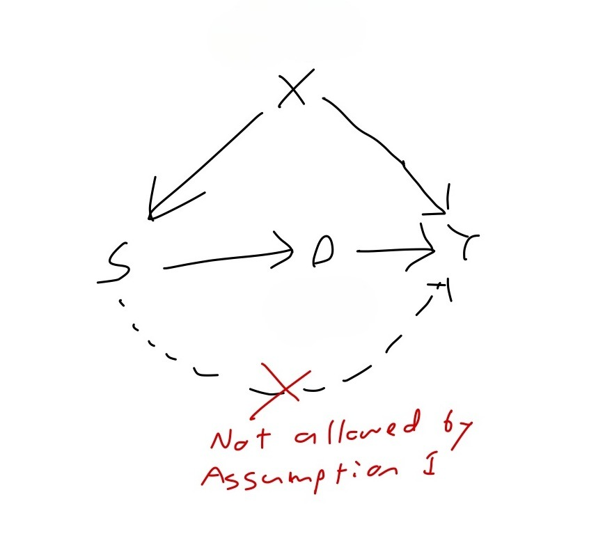
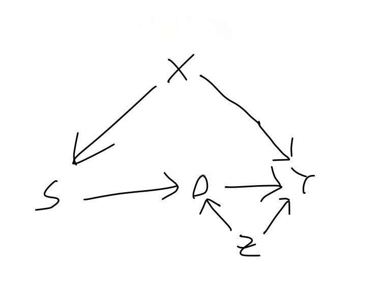

In my previous [blog post](../sampling-bias-and-causal-inference/index.qmd), I motivated the issue of external validity (or lack thereof) and introduced a formal framework for defining the target population average treatment effect (PATE), which is often the thing we're interested in estimating when we do science. In this post, we'll try to understand the conditions that are necessary for us to have some hope of learning about this quantity from data, or using the terminology of causal inference, we'll understand how and when the PATE is identified.

## Tl;dr of causal identification

Using data to effectively learn about causal relationships generally requires additional assumptions above and beyond those needed to learn about associational relationships. We express such assumptions in the form of a causal graph whose vertices are variables and whose directed edges have the meaning "directly causes." With this graph in hand, we can reason about how to use the data we've observed to learn about the causal relationship we're interested in. Unfortunately, in some situations, our reasoning may lead us to the sad conclusion that we *cannot* learn about the causal relationship of interest from the data that we've observed. Often, however, given the assumptions encoded in our graph, our data does tell us something about the causal relationship of interest, and in this case, we say that the causal effect is (perhaps only partially) *identified.* An *identification strategy* amounts to specifying a quantity which could be obtained from an infinite amount of our observed data and which equals (or bounds, if we only have partial identification) the quantity representing the causal effect of interest. Note that identification is precisely this relating of a causal quantity to an associational quantity and it simply lays the groundwork for the subsequent work of actually estimating this associational quantity from the finite data set that we have access to.

## Assumptions and DAGs

Let's recall our framework. We have variables $D$, $S$, $Y$, and $\mathbf{X}$, representing the exposure, sampling indicator, response, and some other pre-treatment covariates, respectively, and we've already defined the target PATE to be $$PATE = \mathbb{E}[Y(1) - Y(0) \mid S =0].$$In the example from Hartman, the exposure $D$ is an intervention in Liberian villages in the wake of the Charles Taylor civil wars in the 1990's and early 2000's, and the response $Y$ is some measure of social reconciliation or welfare in the village. The pre-treatment covariate set $\mathbf{X}$ includes the region in Liberia in which the village is located--either the North, which was the center of conflict during these wars, or the South.

### Assumption 1

The first assumption that will be necessary for us to identify the PATE is what Hartman refers to as the "consistency of parallel studies." In words, this assumption states that whether or not you're in the experimental sample is irrelevant to your response when your exposure is intervened on. In mathematical notation, it says the following

> **Assumption 1 (causal irrelevance of the sampling indicator):**$$Y(s,d)=Y(d)\quad$$ for all $s\in\{0,1\}$.

Finally, in causal graph notation, it says the following:

{width="9.5cm" height="7cm"}

I don't view this as too strong of an assumption. However, situations in which merely belonging to the experimental sample can have a causal effect (that isn't mediated by the exposure $D$) on your response, i.e. violations of Assumption 1, are not impossible to imagine. In particular, the Hawthorne effect refers to a phenomenon in which experimental subjects behave differently in response to their awareness of being observed. (I should note, by the way, that whereas the graph pulled from Hartman in my previous post does not include an arrow from $S$ to $D$, Figure 1 does have this arrow. The explanation for this arrow is that being included in the experiment causes your exposure to get manipulated by the researcher. The existence of this arrow implies that in general, $S$ *does* have a causal effect on the response--the point of Assumption 1, however, is that this effect is fully mediated by the exposure $D$.)

### Assumption 2

Moving on to assumption 2, we've been assuming all along that we are conducting a legitimate RCT in the experimental sample $\Omega_s$. Assumption 2 makes this explicit:

> **Assumption 2 (randomization within the experiment):**$$\{Y(1), Y(0), \mathbf{X}\} \perp\!\!\!\perp D \, \mid \, S=1$$

In terms of our decomposition in the first post of the error in estimating the $PATE$, assumption 2 says that we're effectively free of any concern about treatment imbalance (internal validity) and we can thus focus solely on the issue of sample selection (external validity). If we define the experimental sample average treatment effect (SATE) as

$$SATE = \mathbb{E}[Y(1) - Y(0) \mid S = 1 ],$$

Assumption 2 guarantees that we can identify this quantity.

In terms of our graphical models, it's impossible to show what a violation of Assumption 2 would look like. For example, you might think that Figure 2 represents a violation of Assumption 2 because $Z$ is a confounder of the effect of $D$ on $Y$. But so long as $Z$ only confounds this effect in the target sample and not in the experimental sample, we are OK.

{height="7cm"}

### Assumption 3

The third and final assumption required for PATE identification gets to the heart of the issues surrounding generalization and is by far the most difficult one to guarantee. It says that there exists a set of covariates W, *measured in both the experimental sample and target sample*, which satisfies the following:

> **Assumption 3:**
>
> -   Conditional ignorability$$Y(1) - Y(0) \perp\!\!\!\perp S \, \mid W $$
>
> -   Positivity$$0 < \text{Pr}(S=1 \mid W) < 1$$

To see what this assumption provides, let's step back a moment and consider the main obstacle we are facing in identifying the $PATE$. Since we are able to identify the $SATE$, we would like to use it to identify the $PATE$. According to our set-up, these two quantities are both conditional averages of treatment effects $Y_i(1)-Y_i(0)$, differing only in the value of the sampling indicator $S$ that appear in the conditioning event. Therefore, they can only differ if the treatment effect is distributed differently within the experimental sample versus within the target population. This concern can be dismissed in two idealized scenarios, and it will help our understanding to go over these scenarios. The first is that the experimental sample is a random sample of the target population. Then, conditioning on the value of $S$ gives us no additional information whatsoever. The second is that the treatments effect is constant. Since constant random variables are independent of everything else, conditioning on the value of $S$ gives us no additional information about $Y(1)-Y(0)=constant$.

In the real world, we are in neither of these idealized scenarios: our experimental sample will not be a random sample of our population of interest, and the treatment effect will not be constant across all units.

What, then, can we do in the real world, to have any hope of estimating the PATE? I claimed in the first [blog post](../sampling-bias-and-causal-inference/index.qmd) that the assumptions and techniques that we will need for dealing with threats to external validity have analogs to the assumptions and techniques that were developed for obtaining internally valid treatment effect estimates in observational studies. Internal validity is threatened by treatment imbalance, wherein the units receiving one treatment different in relevant respects from the units receiving the other. We address treatment imbalance by finding a set of covariates such that within strata defined by the joint assignment to the variables in this set, the units receiving one treatment do not differ in the relevant respects from the units receiving the other.[^1]

[^1]: Depending on the discipline, this assumption is referred to as *conditional ignorability*, *conditional exchangeability*, or *exogeneity*, and the identification strategy that goes along with it, backdoor adjustment.

In attempting to transport a causal effect identified in our experimental sample to our target sample, we are dealing with a similar issue of one group of units being unlike a different group of units in some relevant respect. Except now, (1) the groups are defined by sample inclusion and not treatment assignment, and (2) the relevant unlikeness is in treatment effects, i.e. differences in potential outcomes (whereas the relevant unlikeness in the internal validity case was in potential outcomes themselves!) This similarity suggests that we may be able to formulate a strategy for obtaining external validity which parallels the strategy of backdoor adjustment for obtaining internal validity. Indeed we can, and assumption 3 expresses the corresponding assumption. The first part of assumption 3 says that within the strata defined by $W$, the difference in treatment effects across the samples goes away, such that units in the experimental sample have the same distribution of treatment effects as the units in the target sample. The second part of assumption 3 says that every stratum or value of $W$ which appears in the target sample also appears in the experimental sample[^2]. In the case that $W$ satisfies both assumptions 1 and 2, we say that it's an *adjustment set*. For the adjustment set to be useful to us, we must have it measured in both the experimental sample *and* in the target population (which, as we will discuss later, is quite a lot to ask). In such a case, we call $W$ a *valid adjustment set*.

[^2]: There is a corresponding positivity assumption required for backdoor adjustment for internal identification.

When we are doing internal identification, there is a graphical criterion which characterizes variable sets that can be used for backdoor adjustment. We might want to know whether there's a similar graphical criterion that characterizes adjustment sets for external identification. The answer is...sort of. The first part of assumption 3 can be translated to the language of graphs to say that $W$ separates the sampling indicator node from all of the nodes that are treatment effect modifiers. The issue is that whether a variable is an effect modifier does not get expressed in our causal graphs. For a variable to be an effect modifier, it must have a direct arrow into the response, but that alone is not enough. Treatment effect modification occurs when there is some interaction with the treatment, and the presence or absence of interactions are not depicted in a causal graphs.

Let's consider an example. Figure 3 shows the causal graph from Hartman, which appears at the end of my first blog post[^3]. In the scenario as described by Hartman, there were disparate impacts of the civil wars across different regions of Liberia. In particular, the northern region was the center of the conflict and experienced higher levels of internal displacement than the southern region. The level of internal displacement experienced by a given village has an effect on the level of trust within the village, and community trust is a modifier of the effect of the exposure on the response.

[^3]: With the small change that we've added an arrow from the sampling indicator to the exposure, as explained earlier.

-3.jpg){width="15cm"}

In this causal graph we can see that either one of {`Region}` and {`Internal} Displacement}` separates the sampling indicator from `Community Trust`, which is the only thing directly influencing the response other than the exposure `CDR`. As such, either one of {`Region}` and {`Internal Displacement}` satisfies the first part of Assumption 3. What about the other parts of Assumption 3? I mentioned briefly at the end of my first blog post that the authors limit their experimental sample to villages in the north. This implies that {`Region}` does not satisfy the second part of Assumption 3, the positivity condition, as $Pr(S=1 \mid \text{Region = south})=0$. Finally, we could consider using {`Community Trust`} as the adjustment set. The problem with this choice is that `Community Trust` is not a variable that we're likely to have measured in the villages in the experiment, let alone in villages all across the country. Thus, the best bet for an adjustment set in this set-up is {`Internal Displacement`}, assuming that we can measure and observe the levels of displacement all across Liberia, in both the North and South.

What if we assumed that there were an additional variable in our system which has a direct influence on whether a village is included in the experiment as well as on the response $Y$ and which is unobserved.

-4.jpg){width="15cm"}

Then our graph would look something like Figure 4, and one wonders if {`Internal Displacement}` alone remains a valid adjustment set, as it was in Figure 3. The answer is that we cannot know from the graph alone. To determine whether {`Internal Displacement}` is a valid adjustment set, we need to assess whether $U$ is an effect modifier, i.e. whether there is an interaction between $U$ and $CDR$ on $Y$, which is not something that is indicated in causal graphs.

## Identification

We now show that the PATE is identified under Assumptions 1, 2, and 3.

\begin{align*}

PATE &= E[Y(1)-Y(0) \mid S = 0] && \text{by definition} \\

&= E\{E[Y(1)-Y(0) \mid S=0, W] \mid S=0\} && \text{by Law of Iterated Expectations} \\
&= E\{E[Y(1)-Y(0) \mid S=1, W] \mid S=0\} && \text{by part 1 of Assumption 3} \\
&= E\{E(Y(1) \mid S=1, W) - E(Y(0) \mid S=1, W)  \mid S=0\} && \text{splitting up the inner expectation} \\
&= E\{E(Y(1) \mid D=1, S=1, W) - E(Y(0) \mid D=0, S=1, W)  \mid S=0\} && \text{by Assumption 2} \\
&= E\{E(Y \mid D=1, S=1, W) - E(Y \mid D=0, S=1, W)  \mid S=0\} && \text{by consistency of potential outcomes}

\end{align*}

If $W$ is discrete, then we have

$$PATE = \sum_w\{E(Y \mid D=1, S=1, W=w) - E(Y \mid D=0, S=1, W=w)\}Pr(W=w\mid S=0)$$

## How realistic is assumption 3 in practice?

Not very, I'd say! The problem, as I see it, is that $W$ must be measured in the target population (or a representative sample thereof) and measuring variables in the target population is hard! Generalization is hard, and this explains why.

## Final Notes

Notice that our identification of the PATE does not make use of any values of $D$ or $Y$ among units for whom $S$ is 0. This is good because in most set-ups, since we're not running the experiment for units with $S=0$, we don't have this data! If we did measure $D$ and $Y$ among units with $S=0$ (presumably $D$ would all be 0 for these units, since they're certainly not being treated...?), could we use this to improve our estimate? This becomes the problem of combining randomized trial results with observational studies.

I believe that a general framework that encompasses not just this framing of external validity, but other generalization and transportation results is the S-recoverability framework in Pearl and Barenboim. I haven't read the relevant papers, but I think they offer a general framework which includes as a special case everything I've covered in this blog post.

------------------------------------------------------------------------

**References**

Erin Hartman (2021). [Generalizing Experimental Results](https://erinhartman.com/publication/advances_generalizability_expt_findings/). In *Advances in Experimental Political Science*.

Bareinboim, E., & Pearl, J. (2013). A general algorithm for deciding transportability of experimental results. *Journal of causal Inference, 1(*1), 1-7-134

Bareinboim, E., Tian, J., & Pearl, J. (2022). Recovering from selection bias in causal and statistical inference. In *Probabilistic and Causal Inference: The Works of Judea Pearl* (pp. 433-450).
