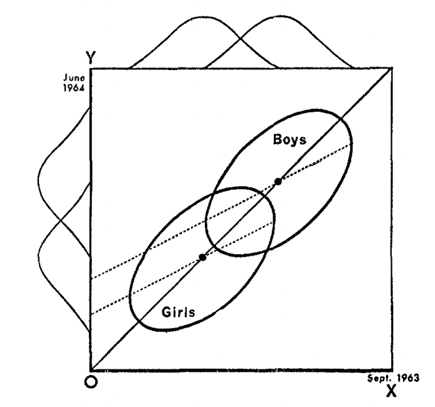

```{r, echo=FALSE, message=FALSE}
knitr::opts_chunk$set(out.width="70%", fig.align='center')
library(tidyverse)
```

## The paradox

Here's the original formulation, appearing in a 1967 article published in *Psychological Bulletins* entitled "A Paradox in the Interpretation of Group Comparisons" [@lord1967paradox]:

> A large university is interested in investigating the effects on the students of the diet provided in the university dining halls and any sex difference in these effects. Various types of data are gathered. In particular, the weight of each student at the time of his arrival in September and his weight the following June are recorded.

> At the end of the school year, the data are independently examined by two statisticians. Both statisticians divide the students according to sex. The first statistician examines the mean weight of the girls at the beginning of the year and at the end of the year and finds these to be identical. On further investigation, he finds that the frequency distribution of weight for the girls at the end of the year is actually the same as it was at the beginning.

> He finds the same to be true for the boys. Although the weight of individual boys and girls has usually changed during the course of the year, perhaps by a considerable amount, the group of girls considered as a whole has not changed in weight, nor has the group of boys. A sort of dynamic equilibrium has been maintained during the year.
>
> The whole situation is shown by the solid lines in the diagram (Figure 1). Here the two ellipses represent separate scatter-plots for the boys and the girls. The frequency distributions of initial weight are indicated at the top of the diagram and the identical distributions of final weight are indicated on the left side. People falling on the solid 45° line through the origin are people whose initial and final weight are identical. The fact that the center of each ellipse lies on this 45° line represents the fact that there is no mean gain for either sex.

```{r}
#| label: fig-central
#| fig-cap: "Weight at end of year (Y) versus weight at beginning of year (X)"
#| echo: false
#| out-width: "50%"


```

> The first statistician concludes that as far as these data are concerned, there is no evidence of any interesting effect of the school diet (or of anything else) on student. In particular, there is no evidence of any differential effect on the two sexes, since neither group shows any systematic change.
>
> The second statistician, working independently, decides to do an analysis of covariance. After some necessary preliminaries, he determines that the slope of the regression line of final weight on initial weight is essentially the same for the two sexes. This is fortunate since it makes possible a fruitful comparison of the intercepts of the regression lines. (The two regression lines are shown in the diagram as dotted lines. The figure is accurately drawn, so that these regression lines have the appropriate mathematical relationships to the ellipses and to the 45° line through the origin.) He finds that the difference between the intercepts is statistically highly significant.
>
> The second statistician concludes, as is customary in such cases, that the boys showed significantly more gain in weight than the girls when proper allowance is made for differences in initial weight between the two sexes. When pressed to explain the meaning of this conclusion in more precise terms, he points out the following: If one selects on the basis of initial weight a subgroup of boys and a subgroup of girls having identical frequency distributions of initial weight, the relative position of the regression lines shows that the subgroup of boys is going to gain substantially more during the year than the subgroup of girls.
>
> The college dietician is having some difficulty reconciling the conclusions of the two statisticians. The first statistician asserts that there is no evidence of any trend or change during the year for either boys or girls, and consequently, a fortiori, no evidence of a differential change between the sexes. The data clearly support the first statistician since the distribution of weight has not changed for either sex.
>
> The second statistician insists that wherever boys and girls start with the same initial weight, it is visually (as well as statistically) obvious from the scatter-plot that the subgroup of boys gains more than the subgroup of girls.
>
> It seems to the present writer that if the dietician had only one statistician, she would reach very different conclusions depending on whether this were the first statistician or the second. On the other hand, granted the usual linearity assumptions of the analysis of covariance, the conclusions of each statistician are visibly correct.
>
> This paradox seems to impose a difficult interpretative task on those who wish to make similar studies of preformed groups. It seems likely that confused interpretations may arise from such studies.
>
> What is the 'explanation' of the paradox? There are as many different explanations as there are explainers.

@fig-central, which is taken directly from Lord's article, captures the entire situation. It's a fantastically simple plot, and yet Lord derives much perplexity from it. We have two groups (boys and girls), and everyone has some variable measured before and after some treatment. That's all that's going on here! That so much perplexity emerges from considering such a simple study is what makes this so hilariously frustrating.

What's going on here? There are at least two perspectives from which we can analyze the paradox and hopefully eliminate some of that perplexity. The first is the perspective of regression to the mean and the second is the perspective of causal inference. In the remainder of this blog post, we'll consider each perspective individually and then attempt to arrive at some conclusions.

## Regression to the mean

If you spend a few seconds looking at @fig-central, you'll immediately identify the curious feature that the two regression lines, in addition to differing from each other, differ from the 45 degree line going through the origin. The latter, aka the line $Y=X$, goes straight through the data clouds for both the boys and the girls[^1]. Why do the regression lines, which estimate the conditional mean of the weight at the end of the year given the weight at the beginning, differ from the line straight through the data? The answer to this question is "regression to the mean," and it lies at the heart of Lord's paradox.[^2]

[^1]: Maybe more precisely, the line Y=X is the major axis of the the ellipses that represent the contour lines of the boys' and girls' bivariate distributions. But I think it's better to say, "it's the line straight through the data."

[^2]: And indeed, is the very reason we call them "regression lines." The origins of the term go back to Francis Galton, who was studying the heights of pairs of fathers and sons, and noticed regression to the mean, when he fit a linear model with OLS. The name stuck, even though most of the time when you fit a linear regression model, X and Y variables aren't measurements of the same variable, so regression to the mean isn't happening (at least literally).

Let's look at a different example before returning to Lord's case.

### Regression to the mean in the NBA

The Denver Nuggets had a great season last year, winning the number 1 seed in the Western Conference and eventually the NBA championship. They brought back most of their guys this year (and didn't make any big acquisitions). Should they expect to have a better or worse record this year than they did last year?

We can attempt to answer this question with data. In particular, we can look at all the previous times[^3] the Nuggets had a good season (defined as an above .500 winning percentage) and see how their record compared the following season.

[^3]: Our data from [Kaggle](https://www.kaggle.com/datasets/boonpalipatana/nba-season-records-from-every-year/data) actually only goes up through the 2017-2018 season

```{r message=FALSE}
# read and wrangle data
records <- read_csv("data/Team_Records.csv") %>%
  select(Season, Team, `W/L%`) %>%
  rename(win_perc = `W/L%`) %>%
  mutate(Team = str_remove(Team, "\\*")) %>%
  mutate(Year_n = as.integer(str_sub(Season, 1, 4))) %>%
  #records in 2017-18 are for only part of the season so we drop this final season from the data
  filter(Year_n < 2017)

# show denver data
denver <- records %>%
  filter(Team == "Denver Nuggets") %>%
  arrange(Year_n)
slice_head(denver, n = 10)

# compare denver's record in winning seasons with their record the following season
denver %>%
  mutate(next_win_perc = lead(win_perc)) %>%
  drop_na(next_win_perc) %>%
  filter(win_perc > 0.5) %>%
  summarise(
    n_winning_record = n(),
    as_good_next_season = sum(next_win_perc >= win_perc),
    winning_next_season = sum(next_win_perc > 0.5)
  )

```

In 18 out of the 23 seasons in which Denver had a winning record, their record the season after was worse. Their record the following season wasn't necessarily bad. In fact, in 17 cases, they achieved a winning record the following season. It just wasn't as good as the season before.

We can get a better estimate of the probability of having a better record next year than this year given that this year you had a winning record if we incorporate the data from every NBA team, not just Denver.[^4]

[^4]: To avoid some hassle, the following fails to consider cases when a team changed its name between seasons.

```{r}
records %>%
  arrange(Year_n) %>%
  group_by(Team) %>%
  mutate(next_win_perc = lead(win_perc)) %>%
  drop_na(next_win_perc) %>%
  ungroup() %>%
  filter(win_perc > 0.5) %>%
  summarise(
    n_winning_record = n(),
    as_good_next_season = sum(next_win_perc >= win_perc),
    winning_next_season = sum(next_win_perc > 0.5)
  )
  
```

In only $269/725 < 40\%$ of the times that a team had an above $500$ this season were they able to match their record the following season.

We can also look at a particular pair of consecutive seasons and see which teams are regressing towards the mean of 500 and which are diverging away it. For the latest pair of seasons in our dataset, 2015-16 to 2016-17, there are more teams regressing towards the mean than diverging away.

```{r echo=FALSE}
library(ggrepel)
season <- records %>%
  filter(Year_n %in% c(2015, 2016)) %>%
  arrange(Year_n) %>%
  group_by(Team) %>%
  mutate(next_win_perc = lead(win_perc)) %>%
  filter(Year_n == 2015) %>%
  mutate(category = case_when(
    (win_perc < next_win_perc &
       win_perc < .5) |
      (win_perc > next_win_perc & win_perc > .5) ~ "regressing",
    (win_perc > next_win_perc &
       win_perc < .5) |
      (win_perc < next_win_perc & win_perc > .5) ~ "diverging"
  ))
ggplot(season, aes(win_perc, next_win_perc, color = category)) +
  geom_point() +
  geom_text_repel(aes(label = str_split_i(Team, " ", -1)), 
                  max.overlaps = 20, 
                  size = 3,
                  key_glyph = "blank") +
geom_abline(aes(col = "line", slope=1, intercept = 0)) +
scale_color_manual(
    breaks = c("regressing", "diverging", "line"),
    values = c("red", "green", "black"),
    labels = c(
      "Regressing towards mean",
      "Diverging away from mean",
      "2015-16 wp = 2016-17 wp"
    )) +
  labs(x = "2015-16 win percentage", y = "2016-17 win percentage") +
  theme_minimal() +
  theme(aspect.ratio=1,
        legend.position = "inside",
        legend.position.inside = c(.2, .85),
        legend.title = element_blank()) +
  guides(color = guide_legend(override.aes = list(linetype = c(0, 0, 1), cex = c(1.5,1.5,0) ) ) )
 
  
```

What's important to note about regression to the mean is that it is a statistical phenomenon, not a physical force[^5]. In particular, while all our examples so far have demonstrated regression to the mean over time, regression to the mean works just as well moving backwards in time. Let's show the same plot, but color the teams based on whether they regress to the mean backwards in time:

[^5]: And for this reason, the name "regression to the mean," which makes it sound like a physical force, is somewhat misleading.

```{r echo=FALSE}
# change to define regression to the mean moving backwards in time
season <- season %>%
  mutate(category = case_when(
    (next_win_perc < win_perc & next_win_perc < .5) |
      (next_win_perc > win_perc & next_win_perc > .5) ~ "regressing",
    (next_win_perc > win_perc & next_win_perc < .5) |
      (next_win_perc < win_perc & next_win_perc > .5) ~ "diverging"
  ))

# plot
ggplot(season, aes(win_perc, next_win_perc, color = category)) +
  geom_point() +
  geom_text_repel(
    aes(label = str_split_i(Team, " ",-1)),
    max.overlaps = 20,
    size = 3,
    key_glyph = "blank"
  ) +
  geom_abline(aes(
    col = "line",
    slope = 1,
    intercept = 0
  )) +
  scale_color_manual(
    breaks = c("regressing", "diverging", "line"),
    values = c("red", "green", "black"),
    labels = c(
      "Regressing towards mean backward in time",
      "Diverging away from mean backward in time",
      "2015-16 wp = 2016-17 wp"
    )
  ) +
labs(x = "2015-16 win percentage", y = "2016-17 win percentage") +
  theme_minimal() +
  theme(
    aspect.ratio = 1,
    legend.position = "inside",
    legend.position.inside = c(.3, .85),
    legend.title = element_blank()
  ) +
  guides(color = guide_legend(override.aes = list(
    linetype = c(0, 0, 1), cex = c(1.5, 1.5, 0)
  )))
```

In this particular case, there was actually one more team that was diverging away from a 50% record (backwards in time) than regressing towards it. But this is not what you should expect (and you can check other pairs of years if you don't believe me). In general, whether you are moving backwards or forwards in time makes no difference--either way, the conditional expectation gets pulled toward the mean of 500.

### Regression to the mean is baked into the bivariate normal

As I mentioned, regression to the mean is better thought of as a statistical artifact than as a physical force. Where does this statistical artifact come from? If random variables $(X,Y)$ are drawn from a bivariate normal distribution $$
(X,Y) \sim N((\mu_X, \mu_Y), 
\begin{bmatrix}
\sigma^2_X & \sigma_{XY} \\
\sigma_{XY} & \sigma^2_Y
\end{bmatrix}),
$$ then the conditional expectation of one given the other[^6] is

[^6]: A derivation can be found here <https://math.stackexchange.com/questions/1531865/conditional-expectation-of-a-bivariate-normal-distribution>

$$
\begin{aligned}
E[Y \mid X=x] &= \mu_Y + \frac{\sigma_{XY}}{\sigma_X^2}(x-\mu_X) \\
&= \mu_Y + \rho \frac{\sigma_Y}{\sigma_X}(x-\mu_X)
\end{aligned}
$$ {#eq-condexp}
Suppose now that X and Y have the same marginal distribution, so $\mu_X = \mu_Y$ and $\sigma_X = \sigma_Y.$ If $X$ and $Y$ have non-negative correlation, i.e. $\rho\geq0$, then substituting into @eq-condexp, we see that the conditional expectation becomes a weighted average:

$$
E[Y \mid X=x] = \rho x + (1-\rho)\mu_Y
$$ {#eq-weight}
If $x > \mu_X = \mu_Y$, then $E[Y \mid X=x] \leq x$, as it is pulled down towards the mean. On the other hand, if $x< \mu_X$, then $E[Y \mid X=x] \geq x$, as it is pulled up towards the mean. We call this regression to the mean. The value of $\rho$ determines how much regressing occurs. For large values of $\rho$ close to 1, there is not much regressing (for $\rho=1,$ no regressing at all). For low values of $\rho$ close to 0, there is much regressing. I'm curious whether there are any other bivariate distributions with regression to the mean.

### Regression to the mean in Lord's data

We can simulate students' pre- and post-year weights as a bivariate normal in R.

```{r lord-data, message = FALSE, fig.cap = "Simulating Lord's data as two bivariate normal distributions"}
library(MASS)
n = 300 # number of students of each sex
mu_girls = c(75,75) # Girls average weight (kg) 
mu_boys = c(85,85) # Boys average weight (kg)
sd = 5 # standard deviation
cor = matrix(c(1,.7,.7,1), 2, 2) #Correlation matrix
Sigma = sd^2*cor
set.seed(770)
data_girls = mvrnorm(n=n, mu_girls, Sigma)
data_boys = mvrnorm(n=n, mu_boys, Sigma)
data = rbind(data_girls, data_boys)
colnames(data) = c("WI", "WF")
lord = as.data.frame(data) %>%
  mutate(S = if_else(row_number() <= n, "girl", "boy"))

```

Here's our data, along with the parallel regression lines for each gender, similar to the figure that appears in Lord's paper:

```{r}
#Now let’s run the regression that Statistician 2 did and extract the coefficients
ancov <- lm(WF ~ WI + S, data = lord)
coef = coef(ancov)
coef_boys = coef[c(1,2)]
coef_girls = c(coef[1] + coef[3], coef[2])
#And now let’s plot:
par(pty = "s")
plot(lord$WI, 
     lord$WF,  
     col = if_else(lord$S == "girl", "orange", "blue"), 
     xlab = "Pre-semester weight",  
     ylab = "Post-semester weight", 
     asp = 1)
abline(coef = coef_girls, col = "orange", lwd = 2, lty = "dashed")
abline(coef = coef_boys, col = "blue", lwd = 2, lty = "dashed")
abline(0,1, col = "black", lwd = 2)
legend("topleft", legend = c("girls", "boys"), 
       col = c("orange", "blue"), pch = 1)


```

There is on average no increase or decrease in weight during the year among the boys, nor is there among the girls. And yet, for each fixed weight, the average boy who starts at that weight at the beginning of the year weighs at the end of the year $(1-\rho(X,Y))(\mu_{boys} - \mu_{girls}) = (1-0.7)\times10 = 3$ kg more than the average girl who starts at that weight. One way of understanding this is to say that both the boy and the girl are expected to regress to their own gender's mean weight. Because the mean for girls is lower than the mean for boys, this means that if the boy and girl start at the same weight in between, regression means different things for the two of them. For the girl, regression means losing weight while for the boy it means, gaining.

To recap, what we've shown is that whenever you have bivariate normal data and the components have identical marginal distributions, you get regression to the mean. When you have two different bivariate distributions, and within each group, there's regression to the mean, you get Lord's paradox.

## Causal inference

Are we done? Have we solved the paradox and understood it completely? From a causal perspective, our understanding so far is insufficient. This perspective is not satisfied with mere joint distributions, but rather seeks to identify and estimate the causal relationships between the variables in the problem.

In a 2016 paper, Judea Pearl proposes a causal model for Lord's hypothetical study [@pearl2016]. In particular, he suggests that the DAG for Lord's study must be given by:

```{r warning = FALSE, message = FALSE, echo = FALSE}
library(ggdag)
node_coords = list(
  x = c("S" = -1, "WI" = 0, "Y" = 0, "WF" = 1),
  y = c("S" = 0, "WI" = 1, "Y" = -1, "WF" = 0)
)
dag <- dagify(WF ~ WI + S,
                     WI ~ S,
                     Y ~ WI + WF,
                     coords = node_coords)
node_labels = c("S", expression(W[F]), expression(W[I]), "Y")
tidy_dag <- tidy_dagitty(dag) %>%
  arrange(name)

ggplot(tidy_dag, aes(x = x, y = y, xend = xend, yend = yend)) +
  geom_dag_point() +
  geom_dag_edges() +
  geom_dag_text(parse = TRUE, label = node_labels) +
  theme_dag()
```

Here, S stands for sex, $W_I$ for initial weight of a student, $W_F$ for final weight, and $Y$ for the difference between the two weights, $Y = W_F - W_I$.

Given this DAG, we can attribute causal estimands to each of the statisticians in the paradox. The first statistician, who looks at the average change score within each gender and compares them, can be seen as estimating the total effect of sex on the change score. Meanwhile, by conditioning on initial weight, the second statistician estimates the direct effect of sex on the final weight, i.e. the effect of sex on final weight that is not mediated by initial weight, at least according to this DAG.

## Conclusion

Unfortunately, I don't think this causal analysis by Pearl is particularly elucidating, nor does it resolve the question of which statistician was correct. I think the fundamental confusion in Pearl's approach is to think of sex and weight as hypothetically manipulable variables. We don't really know what it means to intervene on someone's weight or sex–the counterfactual and its downstream effects would be extremely complicated, and it's somewhat absurd to try to model and estimate them

In fact, I think it is this attempt to do causal inference about non-manipulable variable that confuses Lord himself. In the paragraph that immediate follows the excerpt I quoted at the top of the blog post, Lord offers his own take on the matter:

> In the writer's opinion, the explanation is that with the data usually available for such studies, there simply is no logical or statistical procedure that can be counted on to make proper allowances for uncontrolled preexisting differences between groups. The researcher wants to know how the groups would have compared if there had been no preexisting uncontrolled differences. The usual research study of this type is attempting to answer a question that simply cannot be answered in any rigorous way on the basis of available data.

Lord here characterizes the research question as "how the groups would have compared [had there] been no preexisting uncontrolled differences". To be clear, Lord refers here to a counterfactual in which boys and girls enter college with equal average weights. What would this world look like? More to the point, why would it be of any relevance to a university administrator trying to evaluate the new dining hall?

After all this, it seems quite clear to me that the first statistician, the one who reports that there is no difference in how the members of the two sexes respond to the new dining hall, gets things right. I must admit, I don't have an elaborate justification of their approach, or a causal framework that shows that their estimator is targeting such-and-such causal estimand.

What I do have, however, is an explanation for why we would expect to see the data we did even without one sex reacting differently to the new dining hall. We've seen already that the fact that a male and female student with the same weight at the beginning of the year tend to finish the year at different weights is a mathematical consequence of a property of the bivariate normal distribution, known as regression to the mean. We therefore don't need to posit a differential effect of dining hall based on sex to explain Lord's data. And according to the principal of parsimony, we should not posit such an effect unless we need to.[^7]

[^7]: The point being made in this last paragraph is the same as in Gellman, Hill, and Vehtari's discussion of regression to the mean at the end of Chapter 6 of their textbook *Regression and Other Stories–*the idea, essentially, is to think carefully about the default data generating model and its various implications before concluding that it's inadequate based on the data you've observed.

## References
